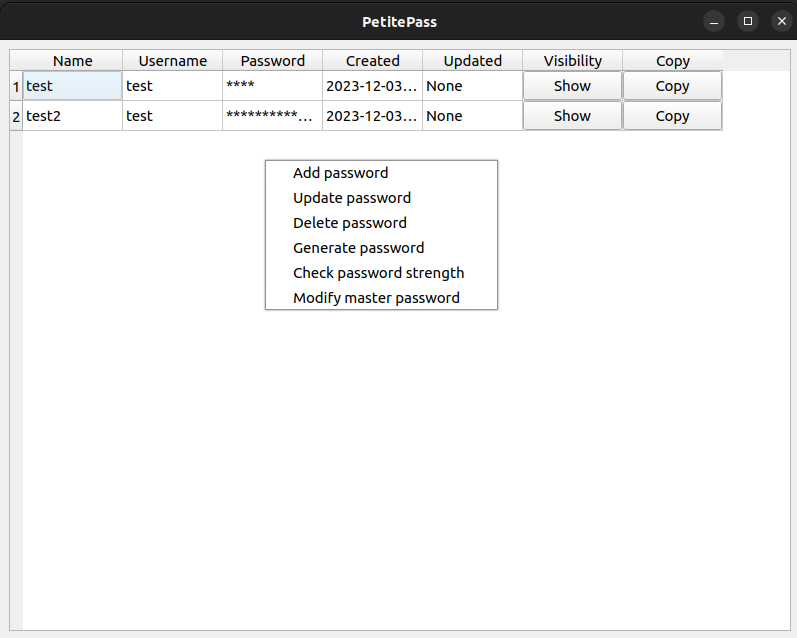

# PetitePass

A simple and secure lightweight password manager coded with Python using SQLCipher for SQLite database encryption and PyQt. This application allows you to securely store, retrieve, and manage your passwords.

## Features

- **Secure Storage:** Passwords are stored in an encrypted database.
- **Password Generator:** Generate strong, random passwords.
- **Password Strength Check:** Evaluate the security level of your passwords.
- **Intuitive GUI:** Easy to use graphical interface.

## Screenshot



## Requirements

Python 3.10

## Installing from source

To install and run the password manager on your system, follow these steps:

1. **Clone the Repository:**

   ```bash
   git clone https://github.com/araujo88/PetitePass.git
   cd PetitePass
   ```

2. **Install Dependencies:**
   Ensure you have Python installed, and then install the required packages:

   ```bash
   make setup
   make install-requirements
   ```

3. **Build the application:**

   ```bash
   make build
   ```

4. **Install the application:**

   ```bash
   make install
   ```

## Usage

At first run, the program will request a password creation for managing the password database. This password must satisfy certain requirements and be entered twice. THIS PASSWORD CANNOT BE RECOVERED WITHOUT RESETTING THE DATABASE.

When the password is created, two files should have been created. One stores the password hash (5f4dcc3b5aa765d61d8327deb882cf99) and the other file (48cccca3bab2ad18832233ee8dff1b0b.db) stores the password encrypted database itself. IF THESE FILES ARE DELETED, ALL STORED DATA WILL BE LOST. The user can upload these files, along with the binary, in a cloud service, although this is highly discouraged. To achieve the most security, all data must be kept offline.

Please note that while this password manager is designed to be secure, it's essential to keep your master password safe and to use the application responsibly.

When the user is logged in, the following options are available when right-clicking on the password table:

- creating a new password entry
- updating an existing password entry
- deleting a password entry
- generate a random password
- check password strength
- modify master password

## Contributing

Contributions to improve PetitePass are welcome. Please follow these steps:

1. Fork the repository.
2. Create a new branch (`git checkout -b feature-branch`).
3. Make your changes and commit them (`git commit -am 'Add some feature'`).
4. Push to the branch (`git push origin feature-branch`).
5. Create a new Pull Request.

## License

This project is licensed under the MIT License - see the [LICENSE](LICENSE) file for details.

## TODOs

- Refactoring
- Write unit tests
- Allow user to edit password directly on the table
